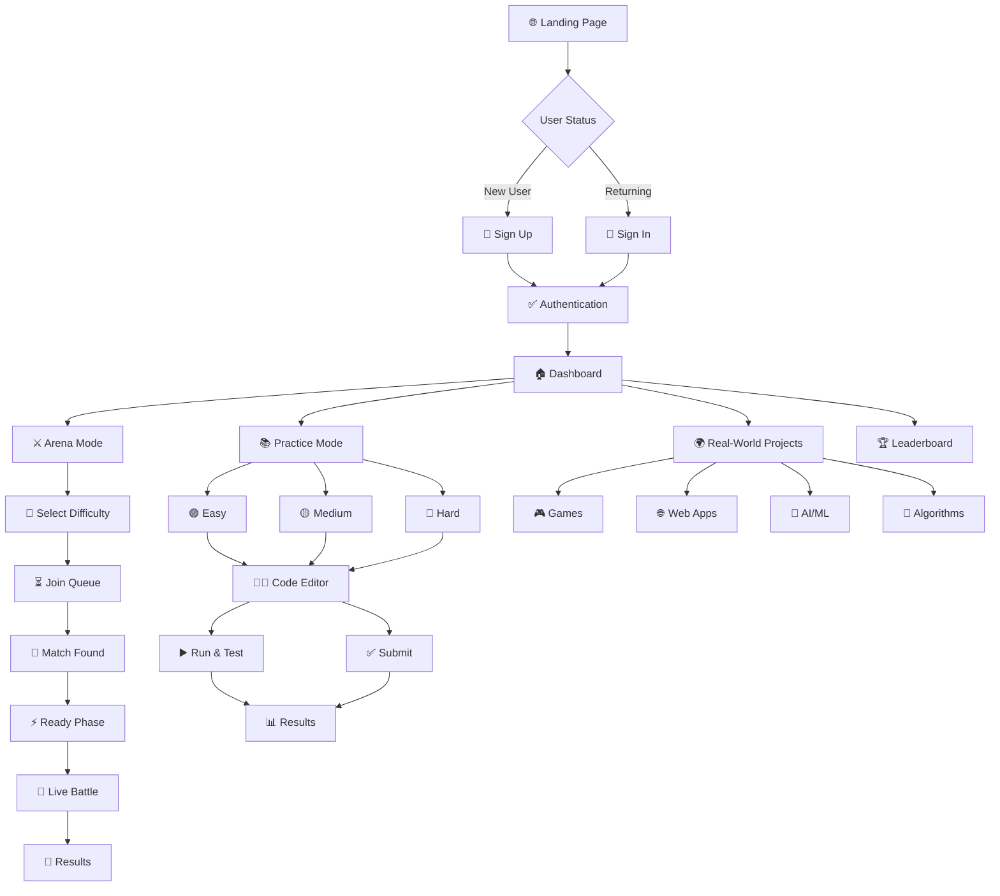

# ⚔️ CodeBattle Arena — Real-Time Competitive Coding Platform

**CodeBattle Arena** is a competitive programming platform featuring real-time 1v1 coding duels, practice modes, and AI-assisted learning. Built for scalability with modern web technologies.

## 🎮 Features

### ⚔️ **Arena Mode - Real-Time PvP Battles**
- Live 1v1 coding duels with WebSocket-powered real-time updates
- Independent player progression (separate timers & question flows)
- Smart matchmaking system based on skill level
- Dynamic scoring: 10 points per test case + 5 bonus for complete solutions
- 5-question rounds with auto-advancement

### 📚 **Practice Modes**
- **Easy/Medium/Hard**: Tiered difficulty levels (5min/8min/15min)
- **Categories**: Arrays, Algorithms, Mathematics, Data Structures
- **Real-World Projects**: Games, Web Apps, AI/ML, IoT challenges
- Multi-language support (JavaScript, Python, C++, Java)

### 🏆 **User System**
- Clerk authentication with secure session management
- Real-time leaderboards and global rankings
- Personal statistics, streaks, and achievement tracking
- Performance analytics and progress insights

---

## 🛠️ Tech Stack

### **Frontend**
- **Languages**: HTML5, CSS3, JavaScript (ES6+)
- **Editor**: ACE Code Editor with syntax highlighting
- **Architecture**: Modular design (7 specialized modules)
- **Real-time**: Socket.IO client for WebSocket communication
- **UI**: Responsive design with dark/light themes

### **Backend**
- **Runtime**: Node.js + Express.js (RESTful APIs)
- **Database**: MongoDB + Mongoose ODM
- **Real-time**: Socket.IO for WebSocket communication
- **Code Execution**: Piston API (40+ language support)
- **Authentication**: Clerk integration

### **External Services**
- **Clerk**: User management & authentication
- **Piston API**: Secure code execution sandbox
- **MongoDB Atlas**: Cloud database hosting

---

## 🎯 User Navigation Flow



---

## 🚀 Quick Start

```bash
# Clone repository
git clone https://github.com/vikashgupta16/CodeBattle-Arena.git
cd CodeBattle-Arena

# Install dependencies
npm install

# Set up environment variables (.env)
MONGODB_URI=mongodb://localhost:27017/codebattle-arena
CLERK_PUBLISHABLE_KEY=your_clerk_key
PORT=8080

# Seed database and start
npm run seed
npm run dev
```

## 📁 Project Structure

```
CodeBattle-Arena/
├── client/
│   ├── public/          # Landing page, auth
│   └── private/         # Authenticated areas
│       ├── Arena/       # Real-time battle mode
│       ├── HomePage/    # Dashboard
│       ├── CoderPage/   # Practice mode
│       └── Easy/Intermediate/Advanced/  # Difficulty levels
└── server/
    ├── index.js         # Main server
    ├── arenaSocket.js   # WebSocket handlers
    ├── arenaDatabase.js # Match management
    └── problemDatabase.js # Problems & submissions
```

---

## 📄 License & Authors

**GPL-3.0-or-later** © 2025

**Authors:**
- [Rouvik Maji](https://github.com/Rouvik) - Backend & Architecture
- [Archisman Pal](https://github.com/Dealer-09) - Frontend & UI/UX
- [Vikash Gupta](https://github.com/vikashgupta16) - Arena System
- [Rajbeer Saha](https://github.com/pixelpioneer404) - Database Design
