# ⚔️ CodeBattle Arena — Real-Time Competitive Coding Platform

**CodeBattle Arena** is a competitive programming platform featuring real-time 1v1 coding duels, practice modes, and AI-assisted learning. Built for scalability with modern web technologies.

## 🎮 Features

### ⚔️ **Arena Mode - Real-Time PvP Battles**
- Live 1v1 coding duels with WebSocket-powered real-time updates
- Independent player progression (separate timers & question flows)
- Smart matchmaking system based on skill level
- Dynamic scoring: 10 points per test case + 5 bonus for complete solutions
- 5-question rounds with auto-advancement

### 🤖 **AI-Powered Assistance**
- Real-time code analysis with Google Gemini AI
- VS Code-style visual indicators (lightbulbs, error/warning icons)
- Per-line and full-program suggestions for beginners
- Test-aware intelligence: disables when all tests pass, re-enables on code changes
- Context-aware hints and debugging assistance

### 📚 **Practice Modes**
- **Easy/Medium/Hard**: Tiered difficulty levels (5min/8min/15min)
- **Categories**: Arrays, Algorithms, Mathematics, Data Structures
- **Real-World Projects**: Games, Web Apps, AI/ML, IoT challenges
- Multi-language support (JavaScript, Python, C++, Java)

### 🏆 **User System & Analytics**
- Clerk authentication with secure session management
- Real-time arena leaderboards and global practice rankings
- Comprehensive statistics: win rates, streaks, match history
- Personal analytics: performance insights, difficulty progress
- Arena player stats with ELO-style ranking system

---

## 🛠️ Tech Stack

### **Frontend**
- **Languages**: HTML5, CSS3, JavaScript (ES6+)
- **Editor**: ACE Code Editor with syntax highlighting
- **Architecture**: Modular design (7 specialized modules)
- **Real-time**: Socket.IO client for WebSocket communication
- **UI**: Responsive design with dark/light themes

### **Backend**
- **Runtime**: Node.js + Express.js (RESTful APIs)
- **Database**: MongoDB + Mongoose ODM
- **Real-time**: Socket.IO for WebSocket communication
- **Code Execution**: Piston API (40+ language support)
- **Authentication**: Clerk integration
- **AI Engine**: Google Gemini 2.0 Flash for code assistance

### **External Services**
- **Clerk**: User management & authentication
- **Piston API**: Secure code execution sandbox
- **MongoDB Atlas**: Cloud database hosting
- **Google Gemini AI**: Intelligent code assistance

---

## 🎯 User Navigation Flow

```mermaid
graph TD
    A[🌐 Landing Page] --> B{User Status}
    B -->|New User| C[📝 Sign Up]
    B -->|Returning| D[🔑 Sign In]
    
    C --> E[✅ Authentication]
    D --> E
    
    E --> F[🏠 Dashboard]
    
    F --> G[📚 Practice Mode]
    F --> H[⚔️ Arena Mode]
    F --> I[🌍 Real-World Projects]
    F --> J[🏆 Leaderboard]
    
    G --> G1[🟢 Easy] 
    G --> G2[🟡 Medium]
    G --> G3[🔴 Hard]
    G1 --> K[👨‍💻 Code Editor + 🤖 AI Assistant]
    G2 --> K
    G3 --> K
    
    H --> H1[🎯 Select Difficulty]
    H1 --> H2[⏳ Join Queue]
    H2 --> H3[🤝 Match Found]
    H3 --> H4[⚡ Ready Phase]
    H4 --> H5[🥊 Live Battle]
    H5 --> H6[🏁 Results & Stats Update]
    
    I --> I1[🎮 Games]
    I --> I2[🌐 Web Apps]
    I --> I3[🤖 AI/ML]
    I --> I4[🧠 Algorithms]
    
    K --> L[▶️ Run & Test]
    K --> M[✅ Submit]
    K --> AI[🤖 AI Hints & Analysis]
    L --> N[📊 Results]
    M --> N
    AI --> O[💡 Smart Suggestions]
    O --> K
```



---

## 🚀 Quick Start

```bash
# Clone repository
git clone https://github.com/vikashgupta16/CodeBattle-Arena.git
cd CodeBattle-Arena

# Install dependencies
npm install

# Set up environment variables (.env)
MONGODB_URI=mongodb://localhost:27017/codebattle-arena
CLERK_PUBLISHABLE_KEY=your_clerk_key
GEMINI_API_KEY=your_gemini_api_key
AI_ASSISTANCE_ENABLED=true
PORT=8080

# Seed database and start
npm run seed
npm run dev
```

## 📁 Project Structure

```
CodeBattle-Arena/
├── client/
│   ├── public/          # Landing page, auth
│   └── private/         # Authenticated areas
│       ├── Arena/       # Real-time battle mode (7 modules)
│       ├── HomePage/    # Dashboard with stats
│       ├── CoderPage/   # Practice mode
│       ├── Leaderboard/ # Rankings & leaderboards
│       ├── common/      # Shared utilities (AI assistance)
│       └── Easy/Intermediate/Advanced/  # Difficulty levels
└── server/
    ├── index.js         # Main server
    ├── arenaSocket.js   # WebSocket handlers
    ├── arenaDatabase.js # Match & stats management
    ├── aiAssistance.js  # Gemini AI integration
    └── problemDatabase.js # Problems & submissions
```

---

## � CI/CD Pipeline

### **GitHub Actions Workflow**
Automated testing, building, and deployment pipeline:

- **🧪 Testing**: Automated unit tests on pull requests
- **🔍 Code Quality**: ESLint and code formatting checks
- **🚀 Auto-Deploy**: Automatic deployment to Render on main branch
- **📦 Dependency Security**: Vulnerability scanning

### **Deployment Commands**
```bash
# Production deployment
npm start                    # Uses: node server/index.js

# Development
npm run dev                  # Uses: nodemon server/index.js

# Database seeding
npm run seed                 # Initialize with sample problems
```

📋 **For detailed deployment instructions, see [DEPLOYMENT.md](DEPLOYMENT.md)**

---

## �📄 License & Authors

**GPL-3.0-or-later** © 2025

**Authors:**
- [Rouvik Maji](https://github.com/Rouvik) - Database Design
- [Archisman Pal](https://github.com/Dealer-09) - Backend & Architecture
- [Vikash Gupta](https://github.com/vikashgupta16) -  Frontend & UI/UX
- [Rajbeer Saha](https://github.com/pixelpioneer404) - Frontend & UI/UX
